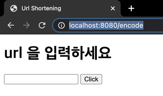
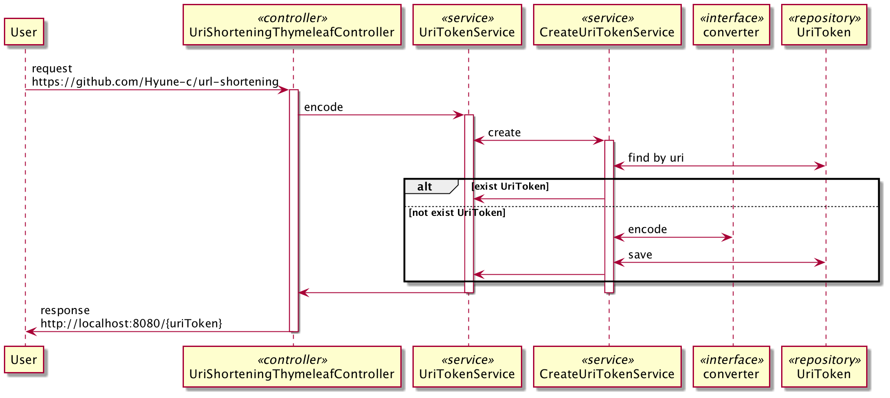
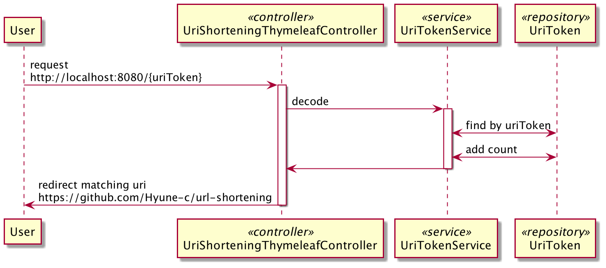

# URL Shortening 을 만들어보자!

## 1. 실행 방법

```shell
# 1. war 생성
> ./gradlew bootwar
BUILD SUCCESSFUL in 7s

> ls build/libs
url-shortening-0.0.1-SNAPSHOT.war

# 2. war 실행
> java -jar -Dspring.profiles.active=dev build/libs/url-shortening-0.0.1-SNAPSHOT.war

# 3. http://localhost:8080/encode 접속
```



## 2. 환경

- springboot 2.5.0
- h2
- ehcache
- thymeleaf

## 3. API 설명

### Get /encode

- 시작 페이지로 이동합니다.

### Post /encode

- uri 을 입력 받아 shortening url 을 생성하고 반환합니다.



### Get /{token}

- token 을 입력받아 uri 로 redirect 합니다.



