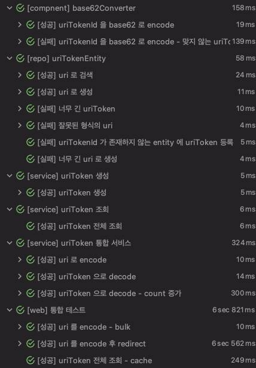

# URL Shortening 을 만들어보자!

> 1. 사용자가 입력한 url 은 UriToken 으로 DB 에 저장됩니다.
> 2. 사용자에게 반환되는 uriToken 은 저장된 리소스의 id 를 62진수로 변환한 값입니다.

기능 별로 세부 내용은 `Issues` 를 참고해주세요!

## 1. 실행 방법

```shell
# 1. war 생성
> ./gradlew bootwar
BUILD SUCCESSFUL in 7s

> ls build/libs
url-shortening-0.0.1-SNAPSHOT.war

# 2. war 실행
> java -jar -Dspring.profiles.active=dev build/libs/url-shortening-0.0.1-SNAPSHOT.war

# 3. http://localhost:8080/encode 접속
```

- 샘플 데이터가 필요하면 사용합니다. [#9](https://github.com/Hyune-c/url-shortening/issues/9)
- `prod` 로 실행하려면 mysql 세팅이 필요합니다.


## 2. 환경

- springboot 2.5.0
- h2, mysql
- ehcache
- thymeleaf

## 3. API 설명

### GET /encode

- 시작 페이지로 이동합니다.

### Post /encode

- uri 을 입력 받아 shortening url 을 생성하고 반환합니다.


### GET /{token}

- token 을 입력받아 uri 로 redirect 합니다.


### GET /api/v1/uriTokens

- 전체 조회 - cache 적용

### GET /api/v1/uriTokens/search

- query 에 uri 를 넣어 단일 UriToken 을 조회합니다.

## 4. 테스트

- ParameterizedTest 를 활용하여 총 1028 개 테스트


